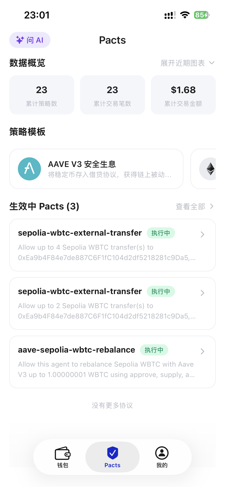
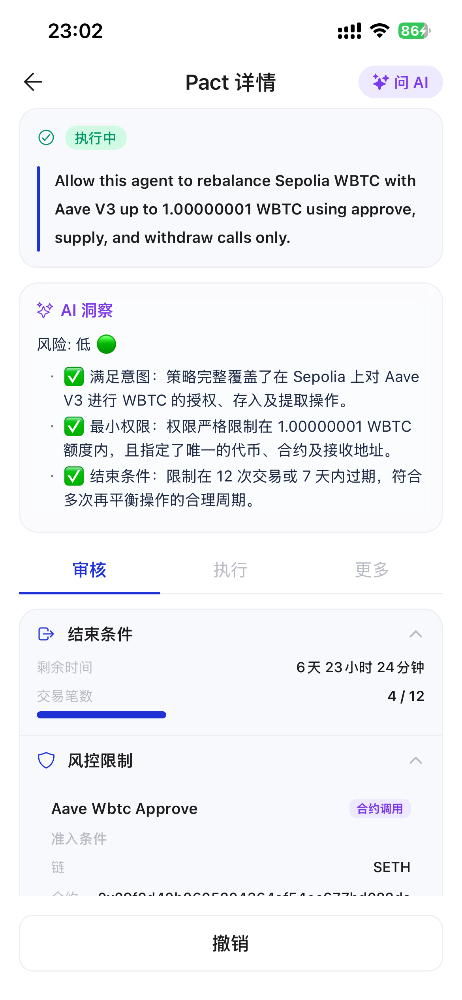
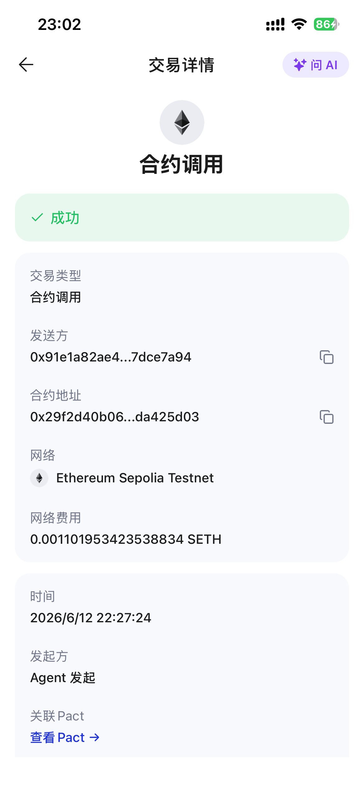
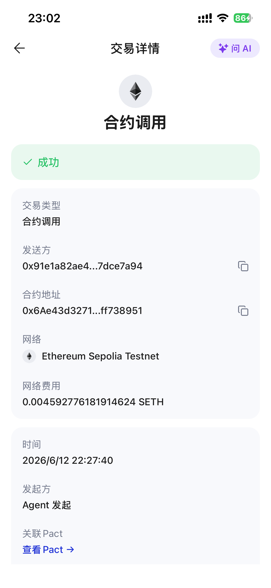

# StableFlow Agent

> 一个由 AI Agent 负责资金决策、Cobo Agentic Wallet Pact 负责权限约束，并通过审计日志解释每一步操作的链上资金管理 Demo。

StableFlow Agent 面向希望简化链上账户管理的普通用户：用户主要处理收款和转账，Agent 根据余额、历史支出和用户偏好管理流动性，并在合适时将闲置资产配置到 Aave。用户仍然掌握最终授权权，可以审批、拒绝或撤销 Pact，也可以按需调整 Agent 的资金策略。

当前 Demo 在 **Ethereum Sepolia Testnet** 上运行，以 **WBTC + Aave V3** 验证完整闭环。项目不使用主网真实资产。

## 项目背景

项目灵感来自货币银行学课程中的创新题：如果 Agent 能够辅助用户管理交易和流动性，使资金在“可随时支付”与“可产生收益”之间更高效地切换，就可能降低用户维持大量闲置货币余额的需求，提高资金使用效率，并在更广泛的应用中改善社会福利。

传统自动交易工具常把“策略判断”和“资金权限”混在一起。StableFlow Agent 将二者拆开：

- **Agent 负责决策**：理解目标、读取资金画像、计算流动性和收益策略。
- **Pact 负责约束**：限定链、资产、合约、方法、额度、次数和有效期。
- **CAW 负责执行**：只在用户批准的权限范围内提交链上操作。
- **Audit Log 负责解释**：记录建议、审批、执行、失败和拒绝原因。

核心原则是：

> Agent proposes. Owner approves. CAW executes.

## 核心功能

- 普通钱包模式：查询余额、展示收款地址、发起 WBTC 转账。
- 资金优化模式：根据钱包余额、Aave 仓位、历史转账和用户目标生成资金计划。
- Aave V3 策略：在 Sepolia 上执行 WBTC `approve`、`supply` 和 `withdraw`。
- CAW Pact Proposal：为 Aave 调仓或指定收款地址的转账申请最小必要权限。
- 人工审批：Agent 不能自行批准 Pact，用户需在 Cobo/CAW App 中审批。
- 用户画像与 Memory：记录风险偏好、流动性下限、低 Gas 偏好和历史行为。
- LLM Treasury Planner：理解复合资金目标并给出可解释方案，确定性 Policy 负责金额计算。
- 审计与失败保护：展示 Pact 状态、交易结果、Gas fee 和失败原因。

## 用户流程

```text
用户目标 / 用户画像
        ↓
LLM Planner + Rule-based Policy
        ↓
资金建议与 Pact Proposal
        ↓
用户在 Cobo/CAW 中审批
        ↓
CAW 校验权限并执行
        ↓
链上结果 + Audit Log
```

例如，用户只需表达“下周有一笔支出，希望剩余资金尽量生息”。Agent 会计算应保留的流动性和 Aave 目标仓位；如果现有 Pact 不足，则先提出新的 Pact，而不是扩大自己的权限。

## 技术架构

```text
React + TypeScript Frontend
            ↓
FastAPI Backend API
            ↓
Agent Orchestrator
   ├── LLM Intent / Treasury Planner
   ├── User Memory
   └── Deterministic Treasury Policy
            ↓
CAW Pact Proposal / Status Check
            ↓
Cobo Agentic Wallet Execution
            ↓
Sepolia WBTC / Aave V3 + Audit Log
```

### 技术栈

| 层级 | 技术 |
| --- | --- |
| Frontend | React 19、TypeScript、Vite |
| Backend | Python、FastAPI、Uvicorn、HTTPX |
| Agent | OpenAI-compatible Chat Completions、规则策略、文件型 Memory |
| Wallet / Security | Cobo Agentic Wallet SDK/API、CAW Pact |
| DeFi | Aave V3 Sepolia、ERC-20 contract call |
| Network | Ethereum Sepolia Testnet |

## 安装与运行

### 环境要求

- Python 3.11+
- Node.js 20+
- npm
- Cobo Agentic Wallet 测试环境账号
- OpenAI-compatible LLM API Key

### 1. 获取代码

```bash
git clone git@github.com:Salieri-128/AI-Web3-Agentic-Builders-Hackathon.git
cd AI-Web3-Agentic-Builders-Hackathon
```

### 2. 配置后端

```bash
cp .env.example .env
```

编辑 `.env`：

```dotenv
LLM_API_KEY=replace_me
LLM_MODEL=DeepSeek-V4-Pro
LLM_FALLBACK_MODELS=Qwen3-235B-A22B-Instruct-2507,Qwen3-Coder-480B-A35B-Instruct
LLM_API_BASE_URL=https://llmapi.paratera.com

AGENT_WALLET_API_URL=https://api.agenticwallet.cobo.com
AGENT_WALLET_API_KEY=replace_me
AGENT_WALLET_WALLET_ID=replace_me
```

`AGENT_WALLET_WALLET_ID` 是 Cobo Agentic Wallet 提供的 Wallet ID，不是 `0x...` EVM 地址。不要把私钥或真实 API Key 提交到 Git。

安装依赖并启动：

```bash
python3.11 -m venv apps/backend/.venv
source apps/backend/.venv/bin/activate
pip install -r apps/backend/requirements.txt

PYTHONPATH=apps/backend uvicorn app.main:app --host 127.0.0.1 --port 8000
```

后端健康检查：<http://127.0.0.1:8000/api/health>

### 3. 配置并启动前端

```bash
cp apps/frontend/.env.example apps/frontend/.env
cd apps/frontend
npm ci
npm run dev -- --host 127.0.0.1
```

打开 <http://127.0.0.1:5173>。

### 4. 重置本地 Demo 状态

```bash
python3 scripts/reset_demo_state.py --yes
```

该命令只清理本地 Demo 数据，不撤销远端 CAW Pact，也不移动链上资产。完整演示步骤见 [Demo 端到端测试路径](docs/DEMO_E2E_TEST.md)。

## 测试与构建

后端：

```bash
PYTHONPATH=apps/backend apps/backend/.venv/bin/python \
  -m unittest discover -s apps/backend/tests -q
```

前端：

```bash
cd apps/frontend
npm run build
```

## 测试网证据

### 地址

| 项目 | Sepolia 地址 |
| --- | --- |
| CAW Agent Wallet | [`0x91e1a82ae48998f8ec577fa895764d957dce7a94`](https://sepolia.etherscan.io/address/0x91e1a82ae48998f8ec577fa895764d957dce7a94) |
| WBTC | [`0x29f2d40b0605204364af54ec677bd022da425d03`](https://sepolia.etherscan.io/address/0x29f2d40b0605204364af54ec677bd022da425d03) |
| aWBTC | [`0x1804bf30507dc2eb3bdebbbdd859991eaef6eeff`](https://sepolia.etherscan.io/address/0x1804bf30507dc2eb3bdebbbdd859991eaef6eeff) |
| Aave V3 Pool | [`0x6Ae43d3271ff6888e7Fc43Fd7321a503ff738951`](https://sepolia.etherscan.io/address/0x6Ae43d3271ff6888e7Fc43Fd7321a503ff738951) |

### 部分交易哈希

| 记录 | Sepolia 交易 |
| --- | --- |
| Transaction 1 | [`0x50c9...716b`](https://sepolia.etherscan.io/tx/0x50c9aee2513c532a166960d68c19cea8e95aa2a66f5dc60a8dbbf8ed875a716b) |
| Transaction 2 | [`0x1f09...1163`](https://sepolia.etherscan.io/tx/0x1f09d3997b57d229a5d0441bcc50f59ecacbd5d2c46f9bec41ec0dddc16c1163) |
| Transaction 3 | [`0xe36b...5d70`](https://sepolia.etherscan.io/tx/0xe36b303ef8540d3ee6b407c461cbef4ada90054bcf016bb09a41e3e41b1f5d70) |
| Transaction 4 | [`0x5e57...d107`](https://sepolia.etherscan.io/tx/0x5e579d5a475fc8ce7e9cdd6119e5d1ec8db7312fab48e079a2657581f5a1d107) |

以下截图进一步记录了 CAW Pact、权限限制和 Sepolia 合约调用结果。

| 证据 | 截图 |
| --- | --- |
| CAW 中生效的 Transfer 与 Aave Rebalance Pacts |  |
| Aave Pact 的额度、方法、次数与有效期限制 |  |
| 同一 Pact 的可审查风险控制详情 |  |
| WBTC `approve` 合约调用成功 |  |
| Aave Pool 合约调用成功 |  |

## 安全与合规边界

- 仅使用 Ethereum Sepolia 测试网，不面向主网真实资金。
- Agent 只能提出 Pact Proposal，不能批准、提额或扩展白名单。
- Aave Pact 仅允许指定 WBTC、Aave Pool 和 `approve` / `supply` / `withdraw` 方法。
- 外部转账 Pact 绑定目标地址、额度、次数和有效期。
- Pact 不足、未激活、被拒绝或被撤销时，操作停止并等待人工介入。
- Memory 只影响策略建议，不构成资金授权。
- 确定性 Policy 执行余额、流动性、Gas 和经济性检查；LLM 不直接决定链上金额边界。
- 项目不存储私钥、明文 API Key 或其他可直接控制资产的凭证。
- 本项目是 Hackathon Demo，不构成投资建议或收益保证。

## 第三方 API、SDK、开源代码与 AI 工具

- [Cobo Agentic Wallet](https://www.cobo.com/) SDK/API：钱包查询、Pact 提交、状态检查和受约束执行。
- [Aave V3](https://aave.com/) Sepolia contracts：WBTC supply / withdraw Demo。
- OpenAI-compatible Chat Completions API：Agent 意图理解和 Treasury Planner；当前示例配置使用 Paratera API。
- React、TypeScript、Vite、FastAPI、Uvicorn、HTTPX、python-dotenv 等开源项目。
- OpenAI Codex：辅助代码实现、测试、文档整理与代码审查。
- Codex `frontend-design` Skill：辅助前端信息架构和视觉实现。

## 当前完成度

- [x] CAW 钱包状态和审计信息查询
- [x] WBTC 外部转账与目标地址限定 Pact
- [x] Aave V3 WBTC approve / supply / withdraw
- [x] Pact Proposal、人工审批和状态刷新
- [x] Rule-based 流动性策略与 Gas 经济性保护
- [x] 用户画像、Memory Proposal 和历史转账分类
- [x] LLM Treasury Planner
- [x] React 对话与资金控制台
- [x] Sepolia 端到端 Demo 路径
- [ ] 3–5 分钟演示视频
- [x] 补充部分 Sepolia 交易哈希
- [ ] 整理完整交易哈希与操作类型映射

## 后续计划

- 支持更多链上资产，优先扩展稳定币。
- 增加更多低风险资金策略和协议适配。
- 支持用户自定义策略参数与可组合 Agent 工具。
- 完善 Pact 模板、异常恢复和跨协议审计。
- 在安全评估完成后探索更多网络，但继续保持人工授权和最小权限原则。

## Hackathon 期间贡献

本仓库从 2026 年 6 月 1 日开始开发。Hackathon 期间完成了 CAW 集成、Aave V3 测试网执行、Pact 审批流程、资金策略、Memory、LLM Planner、前端控制台、测试和演示材料。

## 团队

| 成员 | 角色 | 钱包 | 联系方式 |
| --- | --- | --- | --- |
| Jia Xu | 独立开发者：产品、Agent、前后端与链上集成 | `0x91e1a82ae48998f8ec577fa895764d957dce7a94` | 微信：`Salieri128` |

## 项目材料

- [项目 Proposal](docs/PROPOSAL.md)
- [Demo 端到端测试路径](docs/DEMO_E2E_TEST.md)
- Demo 视频：待补充
